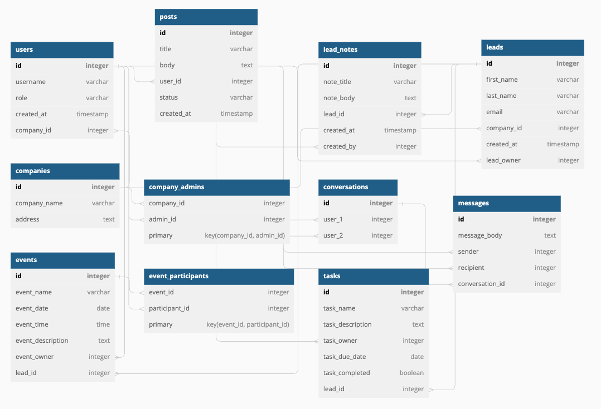

# Welcome to PipelinePro!

PipelinePro is a Customer Relationship Manager built using the latest web technologies to provide a fast and reliable experience. PipelinePro allows you and your team to easily manage leads to close more deals.

### PipelinePro TechStack

**Frontend**: Typescript, React, SASS, Google Firebase, socket-io-client

**Backend**: Node.js, Express, PostgreSQL, socket-io

### Frontend

PipelinePro uses React with TypeScript on the frontend, along with Redux Toolkit for state management, which enables it to efficiently manage data and keep the user interface responsive.

For real-time updates, PipelinePro uses WebSockets, which allows it to push data to the client instantly, ensuring that you always have the most up-to-date information. This makes it easy to keep track of the progress of your leads and stay on top of important deadlines.

### Backend

On the backend, PipelinePro uses PostgreSQL, a powerful relational database management system that provides a robust and scalable data storage solution. The backend is built on a RESTful API architecture, which allows for easy integration with other systems and applications

Curious to see how everthing connects together? Take a look:

